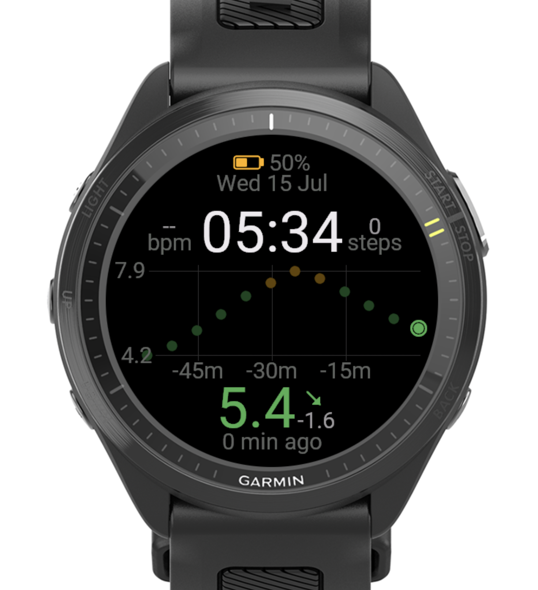
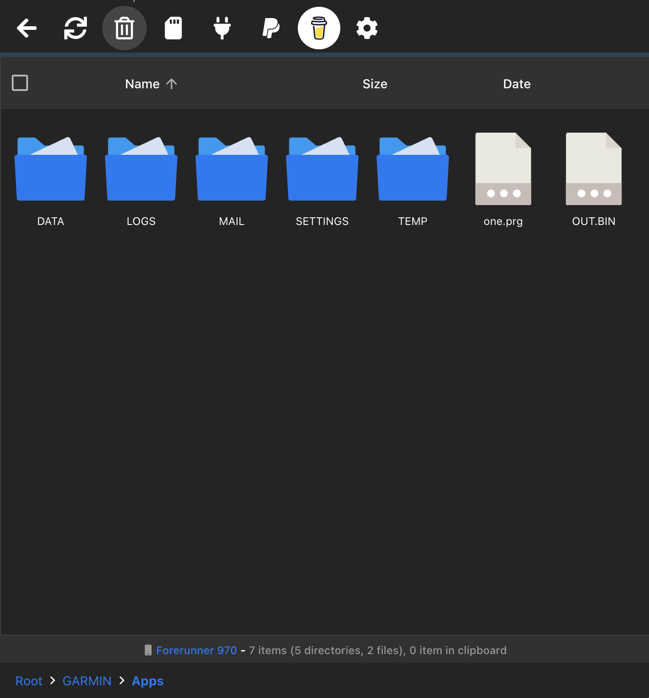

# Garmin CGM Watch Face

A Garmin Connect IQ watch face for the **Forerunner 970** that displays real-time continuous glucose monitor (CGM) readings from a Nightscout server alongside time, date, heart rate, steps, and battery.



---

## Disclaimer

This is an independent, community-built project. It is **not affiliated with, endorsed by, or sponsored by Garmin, Dexcom, Abbott, or the Nightscout Foundation**. It displays glucose data pulled from your own self-hosted Nightscout instance, using credentials you provide, for informational purposes only.

**This app is not a medical device and is not a substitute for your primary CGM receiver or app.** Always confirm glucose readings and trends on your CGM's official display before making any treatment decision, including insulin dosing. Displayed data may be delayed, stale, or unavailable due to network, server, or sensor issues — use at your own risk.

**Assumption of risk.** By installing and using this app, you acknowledge that you are doing so voluntarily and at your own risk, and that you are solely responsible for verifying any data it displays against your primary CGM device before acting on it.

**No warranty.** This software is provided "as is," without warranty of any kind, express or implied, including but not limited to warranties of merchantability, fitness for a particular purpose, accuracy, or non-infringement. See [LICENSE](LICENSE) for the full text.

**Limitation of liability.** To the maximum extent permitted by applicable law, the author(s) of this app shall not be liable for any direct, indirect, incidental, special, consequential, or exemplary damages (including but not limited to health outcomes, missed or incorrect treatment decisions, or data loss) arising out of or in connection with the use, or inability to use, this app — even if advised of the possibility of such damages.

**Your own Nightscout instance.** You are responsible for ensuring you have the right to access and display data from whatever Nightscout instance you configure the app to use (for example, your own data, or a dependent's with appropriate authorization).

## License

Released under the [MIT License](LICENSE) — see that file for the full text, including its own warranty disclaimer.

---

## Features

- Real-time CGM glucose value (mmol/L) with color coding — green (in range), red (low), yellow (high)
- Trend arrow (flat, rising, falling, rapid)
- 60-minute scatter plot of glucose history
- Heart rate and step count
- Battery indicator
- Auto-refreshes every 5 minutes via Garmin background service

---

## Prerequisites

- A Mac (the Garmin SDK CLI is macOS/Linux/Windows, but these instructions use macOS)
- A [Nightscout](https://nightscout.github.io) instance with API v1 enabled
- Your Nightscout API secret (SHA1 hash of your secret)
- A Garmin Forerunner 970 (or simulator for testing)

---

## 1. Install the Garmin Connect IQ SDK

1. Download the **Connect IQ SDK Manager** from [Garmin's developer site](https://developer.garmin.com/connect-iq/sdk/).
2. Open the SDK Manager and install the latest SDK version.
3. The SDK is installed to:
   ```
   ~/Library/Application Support/Garmin/ConnectIQ/Sdks/
   ```
4. Note the exact folder name of the SDK you installed (e.g. `connectiq-sdk-mac-9.2.0-2026-06-09-92a1605b2`). You will use this path in the build commands.

---

## 2. Generate a Developer Key

You need a private key to sign the compiled app. You only do this once.

```bash
openssl genrsa -out ~/Developer/garmin/developer_key 4096
openssl pkcs8 -topk8 -inform PEM -outform DER -in ~/Developer/garmin/developer_key \
    -out ~/Developer/garmin/developer_key.der -nocrypt
```

Store the key somewhere safe — if you lose it you cannot update a watch app signed with it.

---

## 3. Configure Your Nightscout URL

The app no longer needs your Nightscout URL or API secret hardcoded in the source — they're configured as app Settings, in plain text, from the Garmin Connect Mobile app (or the ConnectIQ simulator's own settings menu when testing on your Mac).

- **Nightscout URL** — your Nightscout hostname, e.g. `https://mysite.herokuapp.com` (no trailing slash, no `/api/v1/...` suffix — the app appends that itself)
- **Nightscout API Secret** — your plain-text API secret. The app hashes it to SHA1 at request time on-device, so you never need to run `shasum` yourself.

**In the simulator:** with the app running, open the ConnectIQ simulator window → **Settings** menu → set both fields → the next background fetch (within 5 minutes) picks them up.

**On the watch:** install the app via Connect IQ Store or sideload, then in Garmin Connect Mobile go to **Watch Face settings** for this app and fill in both fields the same way.

If either field is left blank, the background service skips the fetch instead of making a malformed request.

---

## 4. Build

Set your SDK path and run `monkeyc`:

```bash
SDK="$HOME/Library/Application Support/Garmin/ConnectIQ/Sdks/connectiq-sdk-mac-9.2.0-2026-06-09-92a1605b2"

"$SDK/bin/monkeyc" \
    -d fr970 \
    -f monkey.jungle \
    -o bin/one.prg \
    -y ~/Developer/garmin/developer_key
```

A successful build prints `BUILD SUCCESSFUL` and produces `bin/one.prg`.

---

## 5. Run in the Simulator

```bash
SDK="$HOME/Library/Application Support/Garmin/ConnectIQ/Sdks/connectiq-sdk-mac-9.2.0-2026-06-09-92a1605b2"

"$SDK/bin/monkeydo" bin/one.prg fr970
```

The simulator opens and shows the watch face. CGM data won't load from the simulator unless your Nightscout instance is publicly reachable and the simulator has network access.

---

## 6. Install to a Real Watch via OpenMTP

[OpenMTP](https://openmtp.ganeshrvel.com) is a free macOS app for transferring files to Android and Garmin devices over USB.

1. Connect your Forerunner 970 to your Mac with a USB cable.
2. On the watch, select **OpenMTP** when prompted for the connection mode.
3. Open OpenMTP on your Mac. You will see the watch's internal storage.
4. Navigate to `GARMIN > Apps`:

   

5. Drag `bin/one.prg` from your Mac into the `Apps` folder on the watch.
6. Eject the watch and disconnect the USB cable.
7. On the watch, go to **Settings > Watch Faces** and select the new face.

---

## Troubleshooting

**No CGM data shown (`--` instead of a value)**
- Confirm your Nightscout URL and token are correct in `SimpleWatchFace.mc`.
- Make sure your Nightscout instance is publicly accessible (not behind a VPN).
- The background fetch runs every 5 minutes — wait at least one cycle after installing.

**Build fails with "device not found"**
- Make sure you have the `fr970` device profile installed in the SDK Manager.

**`monkeyc: command not found`**
- Check the SDK path — the folder name changes with each SDK version. List `~/Library/Application Support/Garmin/ConnectIQ/Sdks/` to find the current one.
